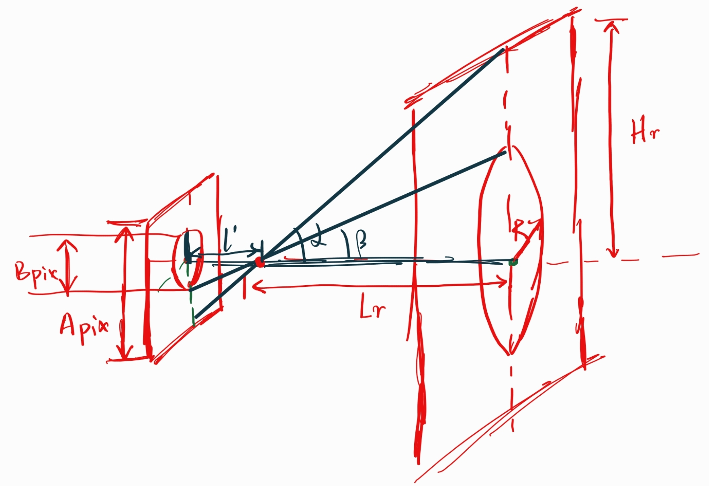
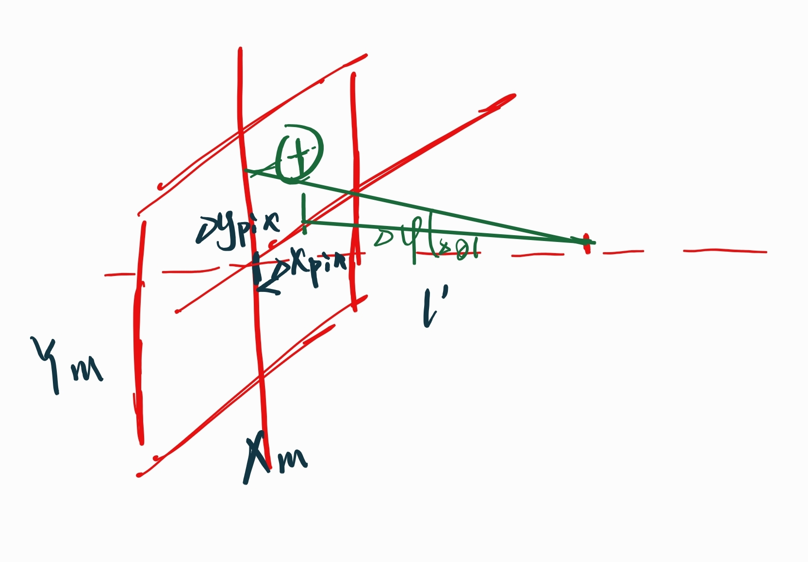

# Image Recognition for Camera / OpenMV

## 测距离



$$
\tan(\alpha) = \frac{A_{pix}}{l'} = \frac{H_m}{L_r}\\
\tan(\beta) = \frac{B_{pix}}{l'} = \frac{R}{L_r}\\
$$
where $R$ is the radius of the maximum blob. 

Thus: 
$$
B_{pix} = \frac{R \times A_{pix}}{\tan(\alpha)} \times \frac{1}{L_r}
$$
where $\frac{RA_{pix}}{\tan(\alpha)}$ is a constant for a specific focal length $l'$.

Therefore:
$$
B_{pix} = \frac{K}{L_r}
$$


where K should be calibrated for a specific focal length.

* [See References](https://book.openmv.cc/image/ranging.html)


## 测角度


$$
\Delta x_{pix} = x-\frac{X_m}{2}\\
\Delta y_{pix} = y - \frac{Y_m}{2}
$$
Therefore: 
$$
\Delta \theta= \arctan(\frac{\Delta x_{pix}}{l'})\\
\Delta \phi= \arctan(\frac{\Delta y_{pix}}{l'})
$$
where $l'$ is the focal length.


* [See References](https://www.cnblogs.com/duwenqidu/p/13960129.html)

## How to Compile


## About
```
Copyright (c) 2023 Robin Young
```
